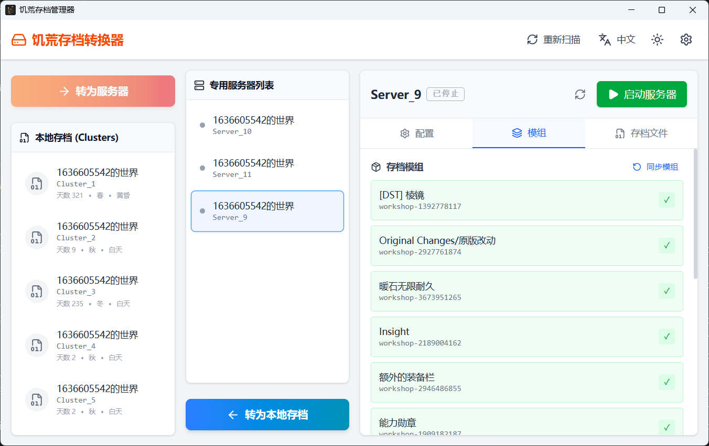
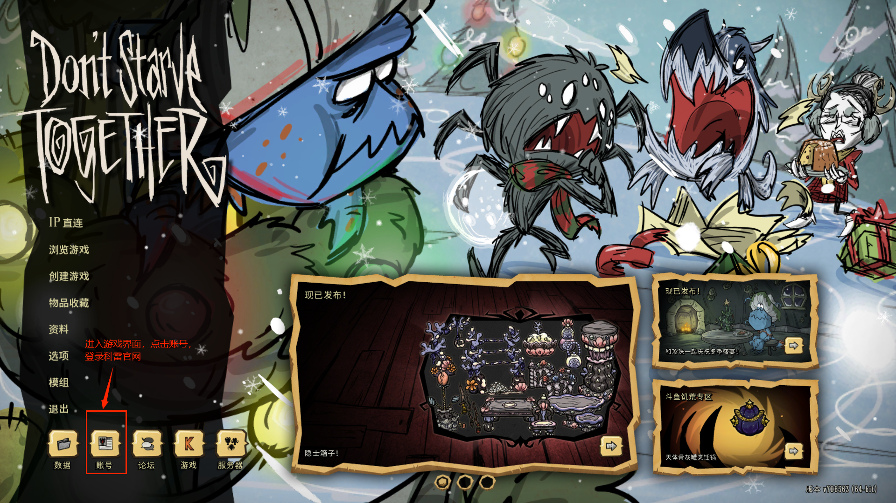
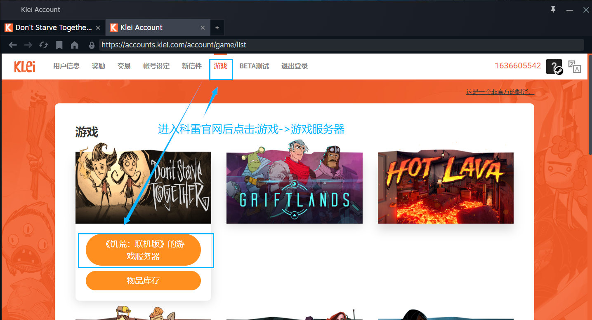
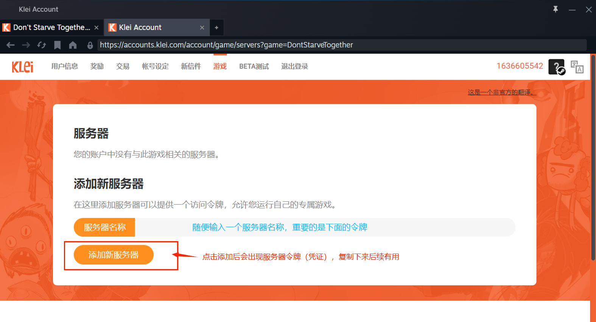

# 饥荒存档管理器 (dst-archive-manager)

一个面向 Windows 的《饥荒：联机版》(Don't Starve Together) 桌面工具：把本地存档转成**专用服务器存档**、
管理这些服务器、检测并同步模组，并在服务器崩档时自动收尾。

## 定位

- **面向谁**：在 Windows 上自建 DST 专用服务器（Dedicated Server）长期联机的玩家/服主，
  希望少敲命令行、能看清存档与模组状态。
- **核心价值**：把"本地存档 → 服务器存档"这条手工路线（复制目录、写 token、生成启动脚本、对齐模组）
  变成几个按钮；并让服务器跑起来之后有人看着。
- **主要场景**：单机单用户、Windows 上开 1~几台专用服务器，自己或朋友联机。

### 能做什么

- 本地存档 ⇄ 服务器存档互转（`Cluster_X` ⇄ `Server_X`）
- 编辑服务器世界配置（名称、描述、密码、人数上限、PVP、无人时暂停）
- 检测服务器所需模组是否缺失，一键把客户端模组同步到服务端
- 启动 / 关闭服务器，界面实时显示运行状态
- **崩档互保**：地面或洞穴任一分片崩档时，自动关闭另一侧，避免半运行状态
- 启动前提醒：缺模组、或存在"只在地面/洞穴单侧"的存档时给出提示（可选择继续）
- 清理"只存在于单侧"的存档（这类存档无法加载）

### 不能做什么

- **不下载/更新 Steam 模组**：订阅与更新请在 Steam 里做，之后回到本工具点「同步模组」
- **不做联机穿透/加速**：服务器对外的可达性（内网穿透、虚拟局域网）需自行解决
- **不修改游戏本体**，不提供云同步/自动备份，也不管理多用户/多实例
- **崩档互保只覆盖"从本工具启动过"的服务器**：手动双击 `StartServer.bat` 起的服务器不受保护
- **仅支持 Windows**（大量依赖 Win32 能力：窗口探测、注册表、键盘输入）

## 功能与界面

界面分三栏：

- **顶栏**：重新扫描、语言切换、主题切换、设置入口
- **左侧**：本地存档列表（`Cluster_X`）
- **中间**：转换按钮与专用服务器列表（`Server_X`）
- **右侧**：选中服务器的详情，分「配置 / 模组 / 存档文件」三个页签

右键列表项可"在文件夹中打开"；右键服务器还可"清理不一致存档"。

## 快速开始

### 环境要求

- Windows 操作系统
- 已安装《饥荒：联机版》客户端
- 已安装**饥荒专用服务器程序**（Steam 库中的 `Don't Starve Together Dedicated Server`）
- 请确保已购买游戏并拥有有效授权

### 1. 填写路径（设置页）

点顶栏的齿轮进入设置页。点「**自动扫描**」会自动检测并填入下面这些目录；检测不到的项手动选择即可：

| 配置项 | 说明 |
|---|---|
| 客户端安装目录 | Steam 库中的 `Don't Starve Together` |
| 服务端安装目录 | Steam 库中的 `Don't Starve Together Dedicated Server` |
| 创意工坊目录 | Steam 库中的 `steamapps\workshop` |
| 存档根目录 | 含 `Cluster_X` 与 `Server_X` 的 `DoNotStarveTogether` 目录（通常在"文档\Klei"下） |

保存时会校验每一项是否为存在的目录；「自动扫描」只覆盖它检测到的项，不会清空你填过的路径。

### 2. 获取服务器令牌

专用服务器需要令牌才能出现在科雷的服务器搜索列表中：

**步骤一**：打开游戏客户端，点击左下角 **"账号"** 按钮登录科雷官网

**步骤二**：进入 [Klei账号页面](https://accounts.klei.com)，点击顶部导航栏的 **"游戏"** → **"《饥荒：联机版》的游戏服务器"**

**步骤三**：在服务器页面输入服务器名称，点击 **"添加新服务器"**，复制生成的令牌

### 3. 填写令牌（设置页）

把令牌粘贴到设置页的「**全局服务器令牌**」。

- 转服务器时会把它写入新服务器的 `cluster_token.txt`，作为默认令牌；
- 某台服务器要用别的令牌，就在它的「配置」页里单独填写；**留空表示使用全局令牌**；
- 也可以在服务器「配置」页点「设置全局token」按钮，一键用全局令牌覆盖该服务器。

## 使用指南

### 转换本地存档为服务器存档

1. 在左侧**本地存档列表**中选择一个存档
2. 点中间的 **"转为服务器"**
3. 转换完成后，新服务器出现在中间列表里（会自动复制存档、写入令牌并生成 `StartServer.bat`，
   同时把客户端模组同步到服务端目录）

反向操作：选中服务器后点 **"转为本地存档"**。

### 启动 / 关闭服务器

1. 在服务器列表中选中要启动的服务器
2. 在右侧「配置」页按需修改世界设置并保存
3. 点右上角的启动按钮

关闭请用界面上的关闭按钮（它会发送 `c_shutdown()`）；**不要直接点控制台窗口的 `X`**，
否则当前进度可能丢失。启动前若检测到缺模组或存在单侧存档，会先弹提示，可选择继续或取消。

### 模组检测与同步

- 「模组」页列出该服务器存档使用的模组；本地缺失的会标红并标记「缺失」
- 缺失的模组请在 Steam 中订阅/更新后，点「同步模组」把客户端模组复制到服务端目录
- 模组名按当前界面语言解析显示；切换语言后重新打开该页即可看到对应语言的名称

### 不一致存档

- 「存档文件」页里**置灰**的条目表示"只存在于地面或洞穴单侧"，这类存档无法加载
- 页面上方会出现提示与「清理不一致存档」按钮；确认后会删除这些单侧存档（同时删除两侧不留残档）

## 数据与日志位置

都放在**程序所在目录**下，卸载程序时会一并删除：

| 路径 | 内容 |
|---|---|
| `dst_data.db` | 配置（目录路径、令牌、语言）与模组名缓存 |
| `logs\` | 运行日志（仅打包版写入；开发构建只输出到控制台） |

服务器存档本身在你配置的「存档根目录」里，不在上述位置。

## 注意事项

1. **关闭服务器**请用管理工具的关闭按钮（或手动输入 `c_shutdown()`），不要用窗口的 `X`
2. **模组一致性**：先在 Steam 订阅/更新模组，再点「同步模组」，否则可能出现世界生成异常
3. **崩档互保范围**：仅覆盖从本工具启动的服务器；手动启动的服务器不会被自动收尾
4. 程序目录不可写时（例如安装在 `Program Files`），配置与日志会自动放到
   `%LOCALAPPDATA%\dst-archive-manager\`

## 常见问题

**Q: 转换后的服务器存档在哪里？**
A: 在你配置的存档根目录下的 `Server_X` 文件夹中。列表里右键选「在文件夹中打开」可直接定位。

**Q: 如何让朋友连上我的服务器？**
A: 服务器所在电脑需要能被访问到：内网穿透、第三方加速器的虚拟局域网（开房间），
或者本身在同一局域网内。然后对方按 `~` 打开控制台输入 `c_connect("房主ip")`，
房主自己输入 `c_connect("127.0.0.1")`。

**Q: 服务器模组怎么更新？**
A: 在 Steam 更新后，点该服务器「模组」页的「同步模组」按钮。

**Q: 为什么令牌要在设置页里填？**
A: 令牌有两个层级——设置页的"全局令牌"作为所有服务器的默认值，单台服务器可在自己的「配置」页覆盖。

## 许可证

本工具为第三方社区工具，与 Klei Entertainment 无关。

---

**提示**：使用本工具前请确保您已购买《饥荒：联机版》并拥有有效的游戏授权。
